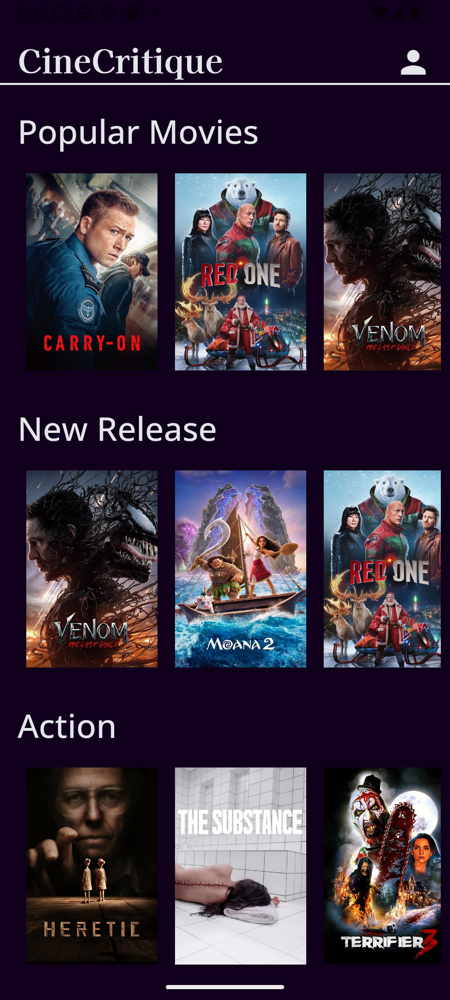
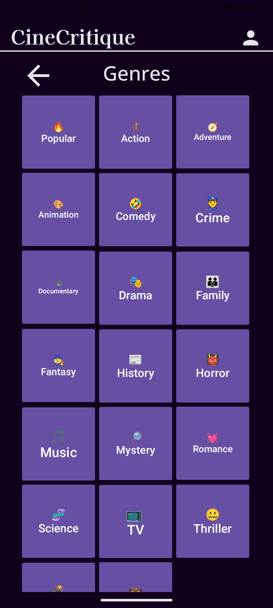
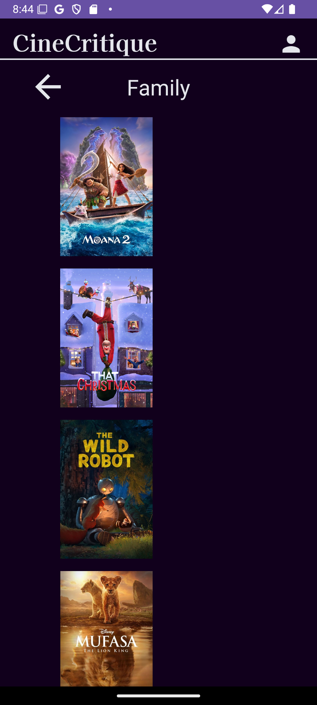
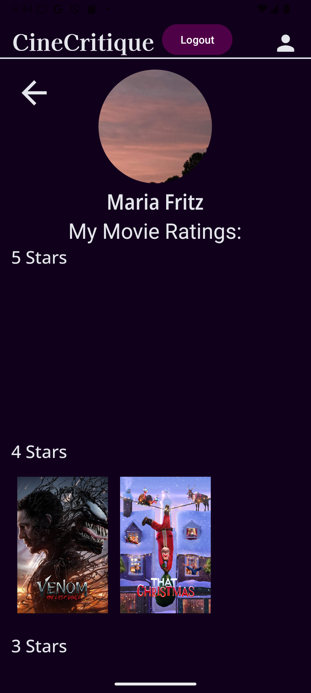

# CineCritique

## Overview
CineCritique is an intuitive and engaging app designed for movie enthusiasts. Users can explore movies by genre, view detailed information about individual films, and interact with their user profile. The app features four main pages:

1. **Main Page**
2. **User Page**
3. **Genre Page**
4. **Individual Movie Page**

## Pages Overview

### 1. Main Page
- **Features:**
  - A scrollable list of movies categorized by genre, implemented using a RecyclerView with images.
  - A clickable profile picture image that navigates to the **User Page**.
  - A "More" button at the bottom of the page that navigates to the **Genre Page**.
- **Navigation:**
  - **To User Page:** Click on the profile picture image.
  - **To Genre Page:** Click on the "More" button.

### 2. Genre Page
- **Features:**
  - A full page of buttons representing different movie genres.
  - A clickable profile picture image that navigates to the **User Page**.
  - A clickable logo button that navigates back to the **Main Page**.
- **Navigation:**
  - **To User Page:** Click on the profile picture image.
  - **To Main Page:** Click on the logo button.

### 3. Individual Movie Page
- **Features:**
  - An image view displaying the movie's poster.
  - Text views for:
    - Movie Title
    - Description
    - Overall Rating
  - A clickable profile picture image that navigates to the **User Page**.
  - A clickable logo button that navigates back to the **Main Page**.
- **Navigation:**
  - **To User Page:** Click on the profile picture image.
  - **To Main Page:** Click on the logo button.

### 4. User Page
- **Features:**
  - An image view displaying the user's profile picture.
  - A list of the user's past given ratings, presented using buttons.
  - A clickable logo button that navigates back to the **Main Page**.
  - A "Logout" button to log out of the app.
- **Navigation:**
  - **To Main Page:** Click on the logo button.

## Screenshots
**Main Screen**

**Genre Screen**

**Individual Movie Screen**

**User Screen**

## Contribution
**Contributors:**
1. Mary Ganey
2. Shivani Iyanar
